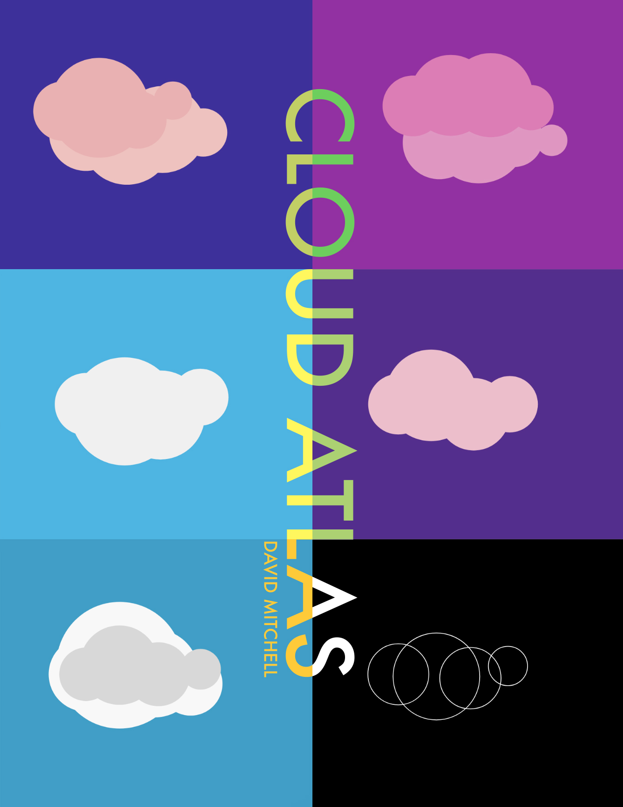

# multiCloud
A p5.js script for generating covers for the book, Cloud Atlas by David Mitchell. Inspired by [Programming Design Systems](https://programmingdesignsystems.com/layout/a-short-history-of-geometric-composition/index.html#a-short-history-of-geometric-composition-DvkJs3o) and this original book cover:

Final book cover

More about the design process can be found [here](https://medium.com/@studioashobby/designing-systems-6e219c4f4ffb?postPublishedType=initial).
